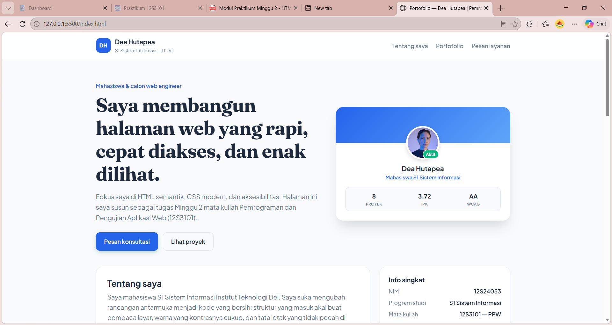

# ppw-2026-week2-12S24053

Tugas Mandiri Minggu 02 — **Pemrograman dan Pengujian Aplikasi Web (12S3101)**
Institut Teknologi Del, Semester Genap 2025/2026.

**Nama:** Dea Hutapea
**NIM:** 12S24053
**Dosen:** Chandro Pardede, S.Kom., M.Sc.

## Deskripsi

Halaman web portofolio profil profesional satu halaman (*single page showcase*) yang
menampilkan identitas akademik, tabel rekapitulasi proyek, daftar keahlian, dan formulir
pemesanan layanan konsultasi. Dibangun dengan HTML5 semantik dan CSS eksternal,
responsif, serta mengikuti standar aksesibilitas WCAG 2.2 Level AA.

## Demo live

https://DeaHutapea.github.io/ppw-2026-week2-12S24053/

## Screenshot



## Struktur berkas

```
ppw-2026-week2-12S24053/
├── index.html      # struktur semantik halaman
├── style.css       # seluruh styling (external CSS)
├── screenshot.png  # tangkapan layar untuk README
└── README.md
```

## Pemenuhan spesifikasi teknis

| No | Kriteria | Implementasi |
|----|----------|--------------|
| 1 | Struktur semantik HTML5 | `header`, `nav`, `main`, 3 `section`, `aside`, `footer` |
| 2 | Tabel & lists | `table` dengan `caption`, `thead`, `tbody`, `tfoot`, `scope`; `ul`, `ol`, `dl` |
| 3 | Formulir accessible | 2 `fieldset` + `legend`, 9 kontrol input, `label for`, `required`, `aria-describedby` |
| 4 | Estetika & tata letak | CSS eksternal, universal box-sizing reset, palet 60-30-10, Flexbox + Grid, media query 768px |
| 5 | Git & deployment | Repositori publik + GitHub Pages |

## Teknologi

HTML5 · CSS3 (Flexbox, Grid, Custom Properties) · Git · GitHub Pages

## Cara menjalankan secara lokal

1. Klon repositori: `git clone https://github.com/DeaHutapea/ppw-2026-week2-12S24053.git`
2. Buka folder di Visual Studio Code.
3. Klik kanan `index.html` → **Open with Live Server**.