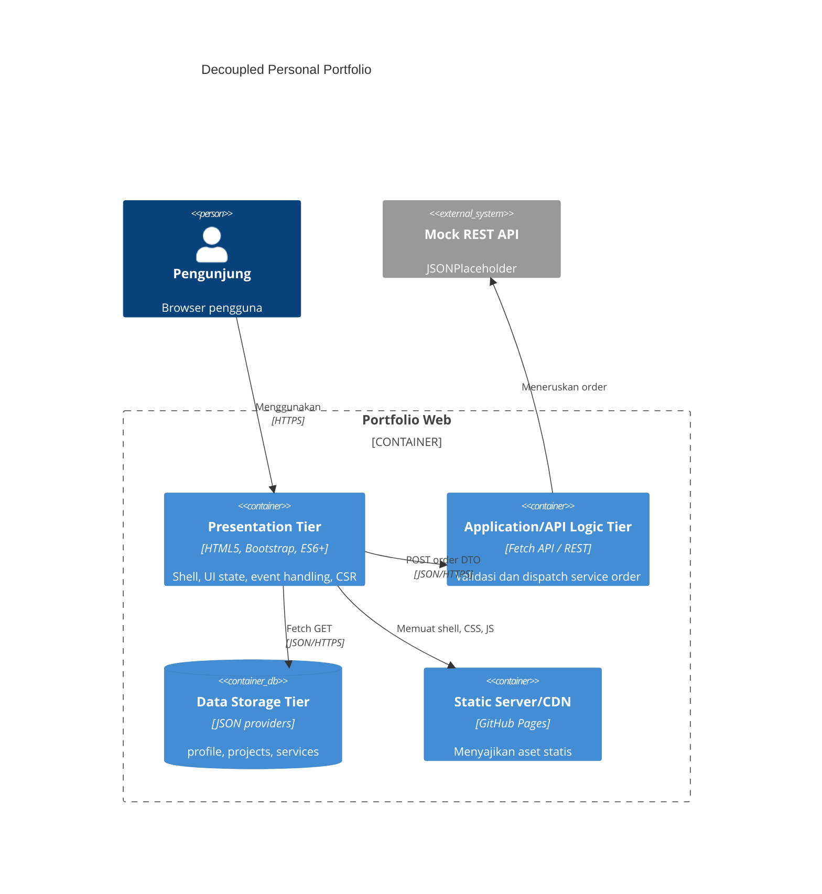

# Week 4 — Decoupled Web Architecture

Refactoring portofolio Week 3 menjadi aplikasi **multi-tier decoupled** dengan
dynamic client-side rendering (CSR), provider JSON modular, universal modal,
REST form dispatch, dan state lokal.

## Struktur

```text
├── index.html
├── css/custom-style.css
├── data/
│   ├── profile.json
│   ├── projects.json
│   └── services.json
├── js/
│   ├── api-service.js
│   └── app.js
└── README.md
```

## C4 Container Model


```mermaid
C4Container
    title Decoupled Personal Portfolio
    Person(user, "Pengunjung", "Browser pengguna")
    Container_Boundary(system, "Portfolio Web") {
        Container(client, "Presentation Tier", "HTML5, Bootstrap, ES6+", "Shell, UI state, event handling, CSR")
        Container(api, "Application/API Logic Tier", "Fetch API / REST", "Validasi dan dispatch service order")
        ContainerDb(json, "Data Storage Tier", "JSON providers", "profile, projects, services")
        Container(cdn, "Static Server/CDN", "GitHub Pages", "Menyajikan aset statis")
    }
    System_Ext(rest, "Mock REST API", "JSONPlaceholder")
    Rel(user, client, "Menggunakan", "HTTPS")
    Rel(client, cdn, "Memuat shell, CSS, JS")
    Rel(client, json, "Fetch GET", "JSON/HTTPS")
    Rel(client, api, "POST order DTO", "JSON/HTTPS")
    Rel(api, rest, "Meneruskan order")
```

Presentation tier hanya bertanggung jawab atas DOM, interaksi, dan visual UI.
`api-service.js` memisahkan akses jaringan dari `app.js`, sedangkan provider
JSON menjadi kontrak data mandiri. Pemisahan ini menerapkan **Separation of
Concerns**: perubahan data tidak memerlukan perubahan markup, dan strategi
transport dapat diganti tanpa mengubah komponen tampilan.

## Checklist implementasi

- [x] Minimal empat proyek lengkap dengan `metrics`, `tags`, `image`, dan `link`.
- [x] Provider `profile.json`, `projects.json`, dan `services.json`.
- [x] `fetch()` + `async/await` melalui `js/api-service.js`.
- [x] Loading spinner, success render, empty filter state, dan error alert.
- [x] Filter kategori instan.
- [x] Tepat satu universal Bootstrap modal berbasis `data-project-id`.
- [x] Rendering memakai `textContent`/DOM API dan validasi URL untuk mengurangi risiko DOM XSS.
- [x] Form dikirim sebagai JSON DTO via HTTP POST tanpa reload.
- [x] Toast Bootstrap untuk sukses/gagal dan tombol submit memiliki loading state.
- [x] Riwayat order disimpan di `localStorage` dan badge jumlah diperbarui reaktif.
- [x] CSP dasar dipasang pada shell HTML.

## Sebelum vs sesudah refactoring

| Aspek | Week 3 | Week 4 |
|---|---|---|
| Sumber data | Kartu dan modal hardcoded di HTML | Provider JSON modular |
| Rendering | HTML statis | CSR dengan `fetch` dan `async/await` |
| Modal | Empat modal terpisah | Satu universal modal berbasis ID |
| Form | Native submit/full reload | POST JSON DTO + Bootstrap Toast |
| State | Tidak persisten | `localStorage` + badge jumlah order |
| Keamanan | Markup dinamis belum terpakai | DOM API, `textContent`, URL guard, CSP |

## Profiling DevTools

Buka proyek melalui **Live Server**, lalu ukur ulang pada Chrome/Edge DevTools
tab Network (disable cache untuk cold load, aktifkan cache untuk warm load).
Tabel ini adalah format pencatatan yang digunakan untuk pengumpulan; angka harus
diisi dari environment browser/hosting saat screenshot waterfall dibuat.

| Skenario | TTFB | FCP | Cache status | Catatan |
|---|---:|---:|---|---|
| Cold load (Disable cache) | isi hasil DevTools | isi hasil Performance | 200 | Transfer shell, CSS, JS, dan JSON |
| Warm load (cache aktif) | isi hasil DevTools | isi hasil Performance | 200/304 | Bandingkan waterfall dan ukuran transfer |

Header `Cache-Control`, `ETag`, dan status `304 Not Modified` bergantung pada
konfigurasi server GitHub Pages/CDN; validasi header aktual pada request JSON
di tab Network, bukan dengan asumsi dari aplikasi.

## Menjalankan

Jalankan **Live Server** pada folder `ppw-2026-week2-12S24053` agar `fetch()`
dapat membaca file JSON (jangan membuka `index.html` dengan protokol `file://`).

Demo Week 3 sebelumnya: <https://deahutapea.github.io/ppw-2026-week2-12S24053/>.
